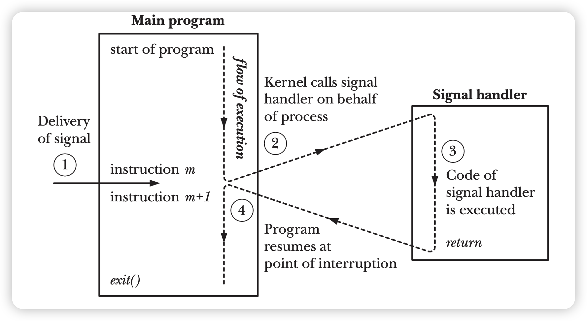

# シグナル

信号はイベント発生時にプロセスに通知するためのメカニズムだ。
一般的な信号には以下がある、SIGINT(ctrl+c),SIGHUPなど。

信号はデフォルトの行為があるけど、信号処理方法を変更することもできる。c言語では、`signal()`関数を使用できる。

!!! note

    `signal()`の動作は異なるUNIX実装間で差異があるため、安定性を追求する場合は`sigaction()`を使用するべきだ。


例は以下の通り：

```c
void newHandler(int sig)
{
    /*code for the handler*/
}
void (*oldHandler)(int); // 関数ポインタ　　
                         //signal（）は旧の関数を返す

oldHandler = signal(SIGINT, newHandler);
if (oldHandler == SIG_ERR)
    errExit("signal");

/*
signal()を使用すると、現在の処理関数
を変更せずに取得することはできません。それを実現
するためには、`sigaction()`を使用する必要があります。
*/

if (signal(SIGINT, oldHandler) == SIG_ERR)
    errExit("signal");
```
信号処理の流れは以下の通り：

{width=500}