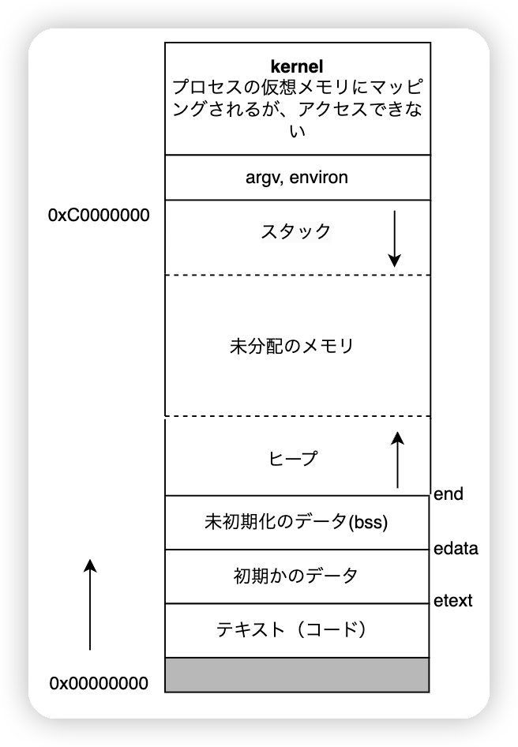

# プロセスとスレッド

プロセスは実行可能なプログラムのインスタンスであり、プロセスが起動されるとき、オペレーティングシステムはユーザー空間とカーネル空間のデータを割り当てる。ユーザー空間には、プログラムの実行コードや変数などが含まれる。一方、かーネルデータには、プログラムの実行に関連する情報が記録される。例えば、プロセスID、オープンされたファイルのディスクリプタテーブル、現在の作業ディレクトリなど。

## プロセスのメモリレイアウト

プロセスで割り当てるメモリは、いくつかの部分で構成されている。一般的に「セグメント」と呼ばれている。以下の図のように示されている。

{width="300"}

## 仮想メモリ管理

全ての仮想メモリを物理メモリにロードすることは明らかに無理だ。オペレーティングシステムは仮想メモリと物理メモリをそれぞれ同じサイズのページに分割し、ページテーブルを通じてマッピングを行う。下の図のように：

{width="300"}

!!! Abstract

    4Gの仮想メモリにおいて、各ページは4KBであるため、ページテーブルエントリの数は1Mになります。1つのページテーブルエントリが4バイトを占有する場合、各プログラムページテーブルは4Mのメモリを占有することになります。多いから、実にのページテーブルはこういうじゃない。 

