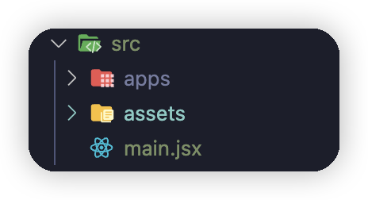
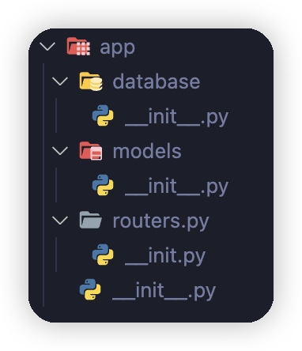

# web開発流れ
## フロントエンド

### 開発環境設定

まず、`node.js`　インストールする必要があります。後で、このコマンドを実行します。

``` shell
npm create vite@latest finance_dashboard -- --template react
```
余分のファイルを削除し、ページコンポーネントを格納するためのフォルダを作成します。次のように表示されます。

{width="300"}

### ログインコンポーネントの開発


## バックエンド

### 開発環境設定

バックエンド開発には　fastapi フレームワークを使用します。次のような表示するファイルを作成します。

{width="200"}

`main.py` に以下のコードを追加します。

```python
from fastapi import FastAPI

app = FastAPI()
```

実行する　`uvicorn app.main:app --reload` api紹介ページを確認します。
