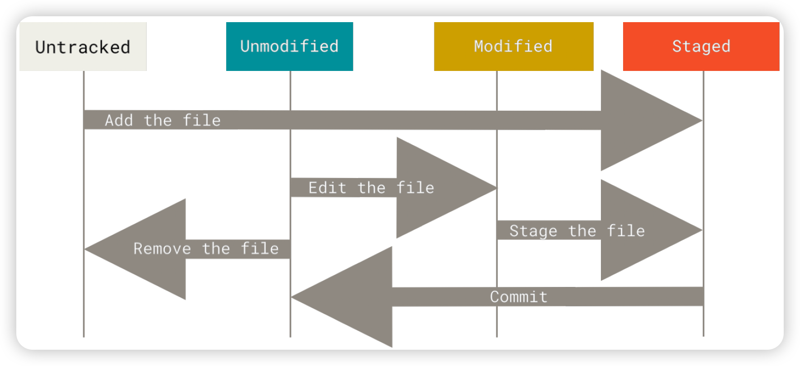
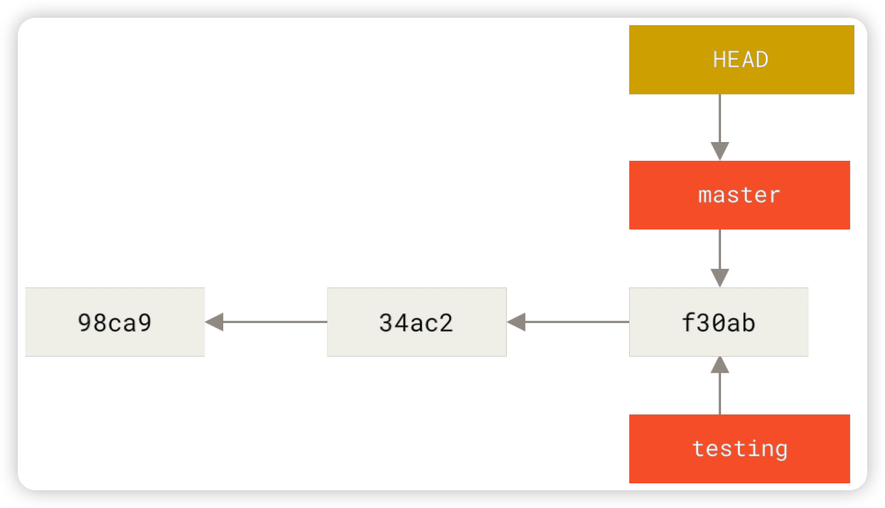

## 個人の識別情報の設定

ユーザー名とEmailアドレスを設定すること
```shell
$ git config --global user.name "John Doe"
$ git config --global user.email johndoe@example.com
```
設定の確認
```shell
git config --list
```

## Git リポジトリの取得
大きく二通りの方法がある

1. 既存のディレクトリでのリポジトリの初期化
```shell
$ git init
```
2.既存のリポジトリのクローン
```shell
# mylibgitは新しく設定するディレクトリ名、省略してもいい
git clone https://github.com/libgit2/libgit2 mylibgit
```

**ファイルの状態の流れ**


ファイルがどの状態にあるのかを知るコマンド
```shell
$ git status
```
ファイルの追跡を開始するには git add コマンドを使用する
```shell
git add <filename> [--all]
```
ステージングエリアの準備ができたら、変更内容をコミットすることができる
```shell
git commit -m "message"
```

**コミット履歴の閲覧**
```shell
git log [--stat]
```
コミットをもう一度やりなおす場合は、--amend オプションをつけてもう一度コミットする。
``` shell
$ git commit -m 'initial commit'
$ git add forgotten_file
# 使ったら、前のコミットは無くなる
$ git commit --amend
```

## Git のブランチ機能

Git におけるブランチとは、単にコミットを指す軽量なポインタに過ぎない。

HEAD と呼ばれる特別なポインタが今のブランチに指す


**新しいブランチの作成**
```shell
$ git branch testing
```
**ブランチの切り替え**
```shell
$ git checkout testing
# これで、HEAD は testing ブランチを指すようになる
```

