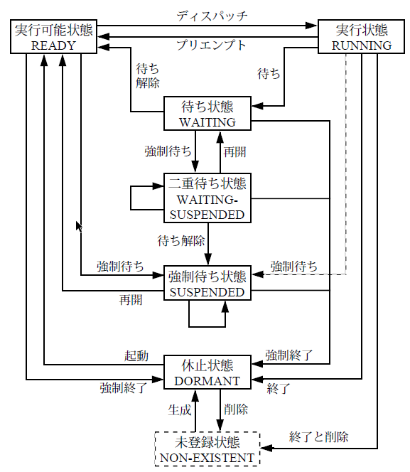

## タスク管理機能

タスクの状態は以下の図の通り:
{width=300px style="display: block; margin: auto;"}

**タスクの記述形式**

```c
void task(VP_INT exinf)
{
    タスク本体
    ext_tsk();
}
```
**タスク生成時に使う情報( T_CTSK Create Task Struct)**

```c
typedef struct t_ctsk{
    ATR tskatr; // タスク属性
    VP_INT exinf;　// タスクの拡張情報
    FP task;　// タスクの起動番地
    PRI itskpri;　// タスクの起動時優先度
    SIZE stksz;　// タスクのスタックサイズ
    VP stk;　// タスクのスタック領域の先頭番地
} T_CTSK
```
### タスクの生成
**APIの説明**
```c
// タスクを生成する
ER　ercd = cre_tsk(ID tskid,T_CTSK *pk_ctsk);
```
**使い方の具体的な例**
```c
// 拡張情報を定義する
typedef struct {
    int device_id;
    char name[16];
} TASK_PARAM;
TASK_PARAM param = {device_id = 42, name = "sensor" };

// タスク本体を定義する
void task(VP_INT exinf){
    TASK_PARAM* p = (TASK_PARAM*)exinf;
    syslog(LOG_NOTICE, "device_id = %d, name = %s", p->device_id, p->name);
    ext_tsk();  // タスク終了
}

// 構造体T_CTSK構造する
T_CTSK ctsk = {
    tskatr = TA_HLNG, // 高級言語のインターフェースで処理単位を起動
    exinf = (VP_INT)&param, // 拡張情報
    task = task, // タスク本体
    itskpri = 5,
    stksz = 4096
};

ER ercd = cre_tsk(1, &ctsk);  // タスクID = 1で登録
if (ercd == E_OK) {
    act_tsk(1);  // タスクを起動（task関数が呼ばれる）
}

```
**要すると、`T_CTSK`を構造して、`cre_tsk`に渡す。**


## タスク付属同期機能

タスクの状態を**直接的に**操作することによって**同期**を行うための機能である。taskを定義する関数の中で直接使う

**APIの説明**
```c
ER ercd = slp_tsk();　// 起床待ち
ER ecrd = wup_tsk(ID tskid);//クラスの起床
```

```c
// TASKA tskid=1
void taskA(VP_INT exinf)
{
    while (1) {
        syslog(LOG_NOTICE, "TaskA: 処理待機中…");
        slp_tsk();  // ← 起床要求が来るまでスリープ（待機）

        syslog(LOG_NOTICE, "TaskA: 起床 → 処理開始");
        // センサーデータ処理など
    }
}

// TASKB
void taskB(VP_INT exinf)
{
    while (1) {
        dly_tsk(1000);  // 1000ms 待つ
        syslog(LOG_NOTICE, "TaskB: TaskA を起こす");
        ER ercd = wup_tsk(1);  // TaskA(ID=1) を起こす

        if (ercd != E_OK) {
            syslog(LOG_ERROR, "TaskB: wup_tsk 失敗 ercd=%d", ercd);
        }
    }
}
```

## 同期・通信機能

### セマフォ
使用されていない資源の有無や数量を数値で表現することにより、その資源を使用する際の排他制御や同期を行うためのオブジェクトである。

**セマフォ生成情報**
```c
typedof struct t_csem{
    ATR sematr; // セマフォ属性
    UINT　isemcnt; // セマフォの資源数の初期値
    UINT　maxsem; // セマフォの最大資源数
}　T_CSEM
```
**セマフォ状態情報**
```c
typedef struct t_rsem{
    ID wtskid; // 待ち行列のタスクのID番号
    UINT　semcnt; // セマフォの現在の資源数
} T_RSEM
```
**APIの説明**
```c
ER ercd = cre_sem(ID semid,T_CSEM *pk_csem); // セマフォの生成
ER ercd = sig_sem(ID semid); // セマフォ資源の返却  セマフォにプラス１
ER ercd = wai_sem(ID semid); // セマフォ資源の獲得
```  
```c
// セマフォを作る
T_CSEM csem = {
    sematr = TA_TFIFO,
    isemcnt = 0,
    maxsem = 1
};
ER　ercd = cre_sem(1,&csem); //セマフォID = 1 を作成

// task A
void taskA(VP_INT exinf) {
    while (1) {
        syslog(LOG_NOTICE, "TaskA: データ準備中…");
        dly_tsk(1000);  // 1秒待つ（データ準備のつもり）

        syslog(LOG_NOTICE, "TaskA: 準備完了 → セマフォ解放");
        sig_sem(1);     // セマフォ + 1
    }
}

// task B
void taskB(VP_INT exinf) {
    while (1) {
        syslog(LOG_NOTICE, "TaskB: セマフォ待ち中…");
        wai_sem(1);  // セマフォID=1 を待つ（準備完了を待つ）セマフォ - 1
                     // セマフォ＝０なら、ずっと待つ
        syslog(LOG_NOTICE, "TaskB: セマフォ取得 → 処理開始");
        // ここで TaskA の処理済みデータを使って何かをする
    }
}

```
### イベントフラグ

イベントの有無をビット毎のフラグで表現することにより、同期を行うためのオブジェクトである。

**flag生成情報**
```c
typedef struct t_cflg {
    ATR　flgatr; // イベントフラグ属性
    FLGPTN iflgptn;　// イベントフラグのビットパターンの初期値
} T_CFLG;
```
**flag状態情報**
```c
typedef struct t_rflg{
    ID　wtskid; // イベントフラグの待ち行列の先頭タスクID
    FLGPTN flgptn;　// 現在のビッドパターン
} T_RFLG
```
**APIの説明**
```c
ER ercd = cre_flg(ID flgid, T_CFLG *pk_cflg);
// イベントフラグ待ち
ER ercd = wai_flg(ID flgid,FLGPTN waiptn,MODE wfmode,FLGPTN *p_flgptn); 
// イベントフラグのセット
ER ercd = set_flg(ID flgid,FLGPTN setptn);
```
**具体的な例**
```c
// イベントフラグ生成
T_CFLG cflg = {
    flgatr = TA_WMUL,  // 複数タスクが待てる
    iflgptn = 0  // 初期フラグ値（全ビットOFF）
};
cre_flg(1,&cflg);

// 待つタスク
void taskA(VP_INT exinf){
    UINT flgptn;
    wai_flg(1,
            0x01,//一番後ろビットの変化を待つ
            TWF_ORW,
            &flgptn);// 実際に立っていたビットが返る
    // ビット1が立った → 通信完了 → 処理継続
}

// 通知タスク
void comm_task(VP_INT exinf) {
    // 通信処理...
    set_flg(1, 0x01);  // ビット1をセット（通信完了通知）
}

```

### データキュー
1ワードのメッセージを受け渡することにより、同期と通信を行うためのオブジェクトである。

**データキュー生成情報**
```c
typedef struct t_cdtq{
    ATR dtqatr; // データキュー属性
    UINT dtqcnt;　// データキュー領域の容量
    VP dtq;　// データキュー領域の先頭番地
}　T_CDTQ;
```
**データーキュー状態情報**
```c
typedef struct t_rdtq{
    ID stskid; // データキューの送信待ち行列の先頭のタスクのID番号
    ID rtskid; // データキューの受信待ち行列の先頭のタスクのID番号 
    UINT sdtqcnt;　// データキューに入っているデータの数
} T_RDTQ;
```

**APIの説明**
```c
ER ercd = cre_dtq(ID dtqid,T_CDTQ *pk_cdtq);
// データキューの送信
ER　ercd = snd_dtq(ID dtqid,VP_INT data);
// データキューの受信
ER ercd = rcv_dtq(ID dtqid,VP_INT *p_data);
```
**具体的な例**
```c
// データキューの生成
T_CDTQ cdtq = {
    dtqatr = TA_TFIFO, // FIFO順（TA_TPRIなら優先度順）
    dtqcnt = 8, // キューの長さ（8個まで送れる）
    dtq = NULL // NULL なら内部で自動確保
};
cre_dtq(1, &cdtq);  // ID=1 のデータキューを生成

// 送信タスク
void taskA(VP_INT exinf) {
    int data = 1234;
    syslog(LOG_NOTICE, "TaskA: データ送信中: %d", data);
    snd_dtq(1, (intptr_t)data);  // ID=1のデータキューに送信
}

// 受信タスク
void taskB(VP_INT exinf) {
    intptr_t received;
    rcv_dtq(1, &received);  // ID=1のデータキューから一つデータを受ける
    syslog(LOG_NOTICE, "TaskB: 受信データ = %d", (int)received);
}

```


## 型の説明

- `VP_INT`: データタイプが定まらないものへのポインタまたはプロセッサに自然なサイズの符号付き整数
- `TA_WMUL`: イベントフラグを複数のタスクが待つことを許す


