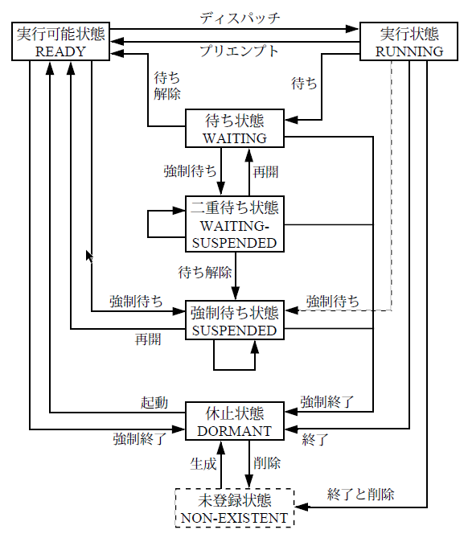

## タスク管理機能

タスクの状態は以下の図の通り:
{width=300px style="display: block; margin: auto;"}

**タスクの記述形式**

```c
void task(VP_INT exinf)
{
    タスク本体
    ext_tsk();
}
```
**タスク生成時に使う情報( T_CTSK Create Task Struct)**

```c
typedef struct t_ctsk{
    ATR tskatr; // タスク属性
    VP_INT exinf;　// タスクの拡張情報
    FP task;　// タスクの起動番地
    PRI itskpri;　// タスクの起動時優先度
    SIZE stksz;　// タスクのスタックサイズ
    VP stk;　// タスクのスタック領域の先頭番地
} T_CTSK
```
### タスクの生成
**APIの説明**
```c
// タスクを生成する
ER　ercd = cre_tsk(ID tskid,T_CTSK *pk_ctsk);
```
**使い方の具体的な例**
```c
// 拡張情報を定義する
typedef struct {
    int device_id;
    char name[16];
} TASK_PARAM;
TASK_PARAM param = {device_id = 42, name = "sensor" };

// タスク本体を定義する
void task(VP_INT exinf){
    TASK_PARAM* p = (TASK_PARAM*)exinf;
    syslog(LOG_NOTICE, "device_id = %d, name = %s", p->device_id, p->name);
    ext_tsk();  // タスク終了
}

// 構造体T_CTSK構造する
T_CTSK ctsk = {
    tskatr = TA_HLNG, // 高級言語のインターフェースで処理単位を起動
    exinf = (VP_INT)&param, // 拡張情報
    task = task, // タスク本体
    itskpri = 5,
    stksz = 4096
};

ER ercd = cre_tsk(1, &ctsk);  // タスクID = 1で登録
if (ercd == E_OK) {
    act_tsk(1);  // タスクを起動（task関数が呼ばれる）
}

```
**要すると、`T_CTSK`を構造して、`cre_tsk`に渡す。**


## タスク付属同期機能

タスクの状態を**直接的に**操作することによって**同期**を行うための機能である。taskを定義する関数の中で直接使う

**APIの説明**
```c
ER ercd = slp_tsk();　// 起床待ち
ER ecrd = wup_tsk(ID tskid);//クラスの起床
```

```c
// TASKA tskid=1
void taskA(VP_INT exinf)
{
    while (1) {
        syslog(LOG_NOTICE, "TaskA: 処理待機中…");
        slp_tsk();  // ← 起床要求が来るまでスリープ（待機）

        syslog(LOG_NOTICE, "TaskA: 起床 → 処理開始");
        // センサーデータ処理など
    }
}

// TASKB
void taskB(VP_INT exinf)
{
    while (1) {
        dly_tsk(1000);  // 1000ms 待つ
        syslog(LOG_NOTICE, "TaskB: TaskA を起こす");
        ER ercd = wup_tsk(1);  // TaskA(ID=1) を起こす

        if (ercd != E_OK) {
            syslog(LOG_ERROR, "TaskB: wup_tsk 失敗 ercd=%d", ercd);
        }
    }
}
```

## 同期・通信機能

### セマフォ
使用されていない資源の有無や数量を数値で表現することにより、その資源を使用する際の排他制御や同期を行うためのオブジェクトである。

**セマフォ生成情報**
```c
typedof struct t_csem{
    ATR sematr; // セマフォ属性
    UINT　isemcnt; // セマフォの資源数の初期値
    UINT　maxsem; // セマフォの最大資源数
}　T_CSEM
```
**セマフォ状態情報**
```c
typedef struct t_rsem{
    ID wtskid; // 待ち行列のタスクのID番号
    UINT　semcnt; // セマフォの現在の資源数
} T_RSEM
```
**APIの説明**
```c
ER ercd = cre_sem(ID semid,T_CSEM *pk_csem); // セマフォの生成
ER ercd = sig_sem(ID semid); // セマフォ資源の返却  セマフォにプラス１
ER ercd = wai_sem(ID semid); // セマフォ資源の獲得
```  
**具体的な例**
```c
// セマフォを作る
T_CSEM csem = {
    sematr = TA_TFIFO,
    isemcnt = 0,
    maxsem = 1
};
ER　ercd = cre_sem(1,&csem); //セマフォID = 1 を作成

// task A
void taskA(VP_INT exinf) {
    while (1) {
        syslog(LOG_NOTICE, "TaskA: データ準備中…");
        dly_tsk(1000);  // 1秒待つ（データ準備のつもり）

        syslog(LOG_NOTICE, "TaskA: 準備完了 → セマフォ解放");
        sig_sem(1);     // セマフォ + 1
    }
}

// task B
void taskB(VP_INT exinf) {
    while (1) {
        syslog(LOG_NOTICE, "TaskB: セマフォ待ち中…");
        wai_sem(1);  // セマフォID=1 を待つ（準備完了を待つ）セマフォ - 1
                     // セマフォ＝０なら、ずっと待つ
        syslog(LOG_NOTICE, "TaskB: セマフォ取得 → 処理開始");
        // ここで TaskA の処理済みデータを使って何かをする
    }
}

```
### イベントフラグ

イベントの有無をビット毎のフラグで表現することにより、同期を行うためのオブジェクトである。

**flag生成情報**
```c
typedef struct t_cflg {
    ATR　flgatr; // イベントフラグ属性
    FLGPTN iflgptn;　// イベントフラグのビットパターンの初期値
} T_CFLG;
```
**flag状態情報**
```c
typedef struct t_rflg{
    ID　wtskid; // イベントフラグの待ち行列の先頭タスクID
    FLGPTN flgptn;　// 現在のビッドパターン
} T_RFLG
```
**APIの説明**
```c
ER ercd = cre_flg(ID flgid, T_CFLG *pk_cflg);
// イベントフラグ待ち
ER ercd = wai_flg(ID flgid,FLGPTN waiptn,MODE wfmode,FLGPTN *p_flgptn); 
// イベントフラグのセット
ER ercd = set_flg(ID flgid,FLGPTN setptn);
```
**具体的な例**
```c
// イベントフラグ生成
T_CFLG cflg = {
    flgatr = TA_WMUL,  // 複数タスクが待てる
    iflgptn = 0  // 初期フラグ値（全ビットOFF）
};
cre_flg(1,&cflg);

// 待つタスク
void taskA(VP_INT exinf){
    UINT flgptn;
    wai_flg(1,
            0x01,//一番後ろビットの変化を待つ
            TWF_ORW,
            &flgptn);// 実際に立っていたビットが返る
    // ビット1が立った → 通信完了 → 処理継続
}

// 通知タスク
void comm_task(VP_INT exinf) {
    // 通信処理...
    set_flg(1, 0x01);  // ビット1をセット（通信完了通知）
}

```

### データキュー
1ワードのメッセージを受け渡すことにより、同期と通信を行うためのオブジェクトである。

**データキュー生成情報**
```c
typedef struct t_cdtq{
    ATR dtqatr; // データキュー属性
    UINT dtqcnt;　// データキュー領域の容量
    VP dtq;　// データキュー領域の先頭番地
}　T_CDTQ;
```
**データーキュー状態情報**
```c
typedef struct t_rdtq{
    ID stskid; // データキューの送信待ち行列の先頭のタスクのID番号
    ID rtskid; // データキューの受信待ち行列の先頭のタスクのID番号 
    UINT sdtqcnt;　// データキューに入っているデータの数
} T_RDTQ;
```

**APIの説明**
```c
ER ercd = cre_dtq(ID dtqid,T_CDTQ *pk_cdtq);
// データキューの送信
ER　ercd = snd_dtq(ID dtqid,VP_INT data);
// データキューの受信
ER ercd = rcv_dtq(ID dtqid,VP_INT *p_data);
```
**具体的な例**
```c
// データキューの生成
T_CDTQ cdtq = {
    dtqatr = TA_TFIFO, // FIFO順（TA_TPRIなら優先度順）
    dtqcnt = 8, // キューの長さ（8個まで送れる）
    dtq = NULL // NULL なら内部で自動確保
};
cre_dtq(1, &cdtq);  // ID=1 のデータキューを生成

// 送信タスク
void taskA(VP_INT exinf) {
    int data = 1234;
    syslog(LOG_NOTICE, "TaskA: データ送信中: %d", data);
    snd_dtq(1, (intptr_t)data);  // ID=1のデータキューに送信
}

// 受信タスク
void taskB(VP_INT exinf) {
    intptr_t received;
    rcv_dtq(1, &received);  // ID=1のデータキューから一つデータを受ける
    syslog(LOG_NOTICE, "TaskB: 受信データ = %d", (int)received);
}

```
### メールボックス
共有メモリ上に置かれたメッセージを受け渡しすることにより、同期と通信を行うためのオブジェクトである。

**メールボックス情報構造体**
```c
//生成情報
typedef struct t_cmbx{
    ATR mbxatr; //　メールボックス属性
    PRI maxmpri;　// 送信されるメッセージの優先度の最大値
    VP mprihd;　// 優先度別のメッセージキューヘッダ領域の先頭番地
}T_CMBX;
// 状態情報
typedef struct t_rmbx{
    ID wtskid; // メールボックスの待ち行列の先頭のタスクのID
    T_MSG* pk_msg; // メッセージキューの先頭のメッセージパケットの先頭番地
}T_RMBX;
```
**APIの説明**
```c
ER ercd = cre_mbx(ID mbxid,T_CMBX *pk_cmbx); //メールボックスの生成
ER ercd = snd_mbx(ID mbxid,T_MSG *pk_msg); // メールボックスの送信
ER ecrd = rcv_mbx(ID mbxid,T_MSG **ppk_msg); // メールボックスからの受信
```
**具体的な例**
```c
// メールボックスを作る
T_CMBX cmbx = {
    mbxatr = TA_TFIFO, // FIFO順
    maxmpri = 0 // 優先度並びを使わない場合は 0
};
cre_mbx(1,&cmbx); // ID=1 のメールボックス生成

// メッセージ構造体の定義
typedef struct {
    T_MSG msg_header;  // メールボックス用ヘッダ（必須）
    　　　　　　　　　　// 優先度を使いたいならT_MSG_PRIを書く
    int data; // 実際に送りたいデータ
}MY_MSG;

// メッセージの送信
MY_MSG msg = { data = 123 };
snd_mbx(1,(T_MSG*)&msg);  // メッセージ構造体を送信

// メッセージの受信
T_MSG* p_msg;
rcv_mbx(1,&p_msg);
MY_MSG* my = (MY_MSG*)p_msg; // キャストして中身を読む

syslog(LOG_NOTICE, "受信データ = %d", my->data);
```
## 拡張同期・通信機能

拡張同期・通信機能はタスクとは独立したオブジェクトにより、タスク間の高度な同期・通信を行うための機能である。

### ミューテックス
**優先度逆転**:低優先度のタスクがリソース（ミューテックス）を保持していて,ただ動いてるだけ中優先度のタスク実行しているから、低優先度のタスク実行できなくて、リソースをリリースできない。リソースを待っている高優先度タスクはずっと待ってしまう。これを防ぐために、二つの解決方法がある。

- **優先度継承プロトコル**：　リソースを持っている低優先度タスクの優先度を、一時的に「待っている中で一番高いタスク」と同じに引き上げる。

- **優先度上限プロトコル**：リソースごとに「上限優先度（最大優先度）」を決めておき、それ以上のタスクしか使えないようにする。低優先度のタスク資源を使えない、中優先度のタスクは高優先度のタスクに影響を与えられない。

**ミューテックス生成情報**
```c
typedef struct t_cmtx{
    ATR mtxatr; //ミューテックス属性
    PRI ceilpri;　// ミューテックスの上限優先度
}T_CMTX;
```
**APIの説明**
```c
ER ercd = cre_mtx(ID mtxid, T_CMTX *pk_cmtx); // ミューテックスの生成
ER ercd = loc_mtx(ID mtxid); //ミューテックスのロック
ER ercd = unl_mtx(ID mtxid); //ミューテックスの解除
```

**具体的な例**

```c
// 優先度継承プロトコル
T_CMTX cmtx = {
    mtxatr = TA_INHERIT,//優先度継承プロトコルを指定
};
// 優先度上限プロトコル
/*
T_CMTX cmtx = {
    .mtxatr = TA_CEILING,  // 優先度上限プロトコル
    .ceilpri = 5           // 優先度上限（5に一時的に引き上げ）
};
*/
cre_mtx(1, &cmtx);  // ミューテックスID = 1

// TASK A
void taskA(VP_INT exinf) {
    loc_mtx(1);  // ミューテックス取得
    syslog(LOG_NOTICE, "TaskA: 処理中…");
    dly_tsk(5000);  // 長時間処理
    unl_mtx(1);     // ミューテックス解放
}
// TASK B
void taskB(VP_INT exinf) {
    while (1) {
        syslog(LOG_NOTICE, "TaskB: 割り込み処理中");
        dly_tsk(1000);
    }
}
// TASK C 
void taskC(VP_INT exinf) {
    dly_tsk(1000);  // 少し遅れて起動
    loc_mtx(1);     // TaskAがロック中ならここで待機
    syslog(LOG_NOTICE, "TaskC: ミューテックス取得成功！");
    unl_mtx(1);
}

```
### メッセージバッファ
可変長のメッセージを受け渡しすることにより、同期と通信を行うためのオブジェクトである。

**生成情報構造体**
```c
typedef struct t_cmbf{
    ATR mbfatr; /*メッセージバッファ属性*/
    UINT maxmsz;　//　1メッセージの最大サイズ（バイト数）
    SIZE mbfsz;　// メッセージバッファ領域のサイズ（バイト数）
    VP mbf; // メッセージバッファ領域の先頭番地
}　T_CMBF;
```

**APIの説明**
```c
// メッセージバッファの生成
ER ercd = cre_mbf(ID mbfid,T_CMBF *pk_cmbf);
// メッセージバッファの送信
ER ercd = snd_mbf(ID mbfid,VP msg,UINT msgsz);
// メッセージバッファの受信
ER_UINT msgsz = rcv_mbf(ID mbfid,VP msg); 
```
**具体的な例**
```c
// バッファの生成
static UB mbf_buffer[BUF_SIZE];  // バッファ領域（UB＝unsigned char）
T_CMBF cmbf = {
    .mbfatr = TA_TFIFO,    // FIFO順で処理
    .maxmsz = 64,     // 1メッセージ最大サイズ
    .mbfsz  = 256,    // 総バッファサイズ
    .mbf    = (VP)mbf_buffer  // 自前のバッファ
};

ER ercd = cre_mbf(1, &cmbf);
if (ercd != E_OK) {
    syslog(LOG_ERROR, "メッセージバッファ作成失敗: %d", ercd);
}
// メッセージ送信
char msg[]="こんにちは、μITRON！";
snd_mbf(1, msg, strlen(msg) + 1);  // +1 はNULL終端のため

// メッセージ受信
char recv_buf[MAX_MSG];
rcv_mbf(MBF_ID,recv_buf);

```
### ランデブ
タスク間で同期通信を行うための機能で、双方のタスクが待ち合わせるためのオブジェクトを、ランデブポートする。

**生成情報構造体**
```c
typedef struct t_cpor{
    ATR poratr; // ランデブポート属性
    UINT maxcmsz;　// 呼出しメッセージの最大サイズ（バイト数）
    UINT maxrmsz;　// 返答メッセージの最大サイズ（バイト数）
}T_CPOR;
```
**APIの説明**
```c
ER　ercd = cre_por(ID porid,T_CPOR *pk_cpor);
// ランデブの呼出し
ER_UINT rmsgsz = cal_por(ID porid,RDVPTN calptn,VP msg,UINT cmsgsz);
// ランデブの受付
ER_UINT cmsgsz = acp_por(ID porid,RDVPTN acpptn,RDVNO *p_rdvno,VP msg);
// ランデブの回送
ER　ercd = fwd_por(ID porid,RDVPTN calptn,RDVNO rdvno,VP msg,UINT cmsgsz);
```

**具体的な例**
```c
// ランデブポートの作成
T_CPOR cpor = {
    poratr = TA_TFIFO,
    maxcmsz = 32,
    maxrmsz = 32
};
ER ercd = cre_por(1, &cpor);
if (ercd != E_OK) {
    syslog(LOG_ERROR, "ポート作成失敗: %d", ercd);
}

// クライアント側のタスク
void client_task(VP_INT exinf) {
    char buffer[64];  // 呼び出しメッセージと返答を共有
    strcpy(buffer, "Hello");  // 呼び出しメッセージ

    // ランデブ呼び出し → サーバからの返答も受信
    ER_UINT recv_len = cal_por(1, 0, buffer, strlen(buffer) + 1); // 0はRDVPTN番号　サーバ側と一致

    if (recv_len < 0) {
        syslog(LOG_ERROR, "ランデブ呼び出し失敗: %d", recv_len);
    } else {
        syslog(LOG_NOTICE, "返答受信: %s（%d バイト）", buffer, recv_len);
    }
}


// サーバ側のタスク
void server_task(VP_INT exinf) {
    char recv_buf[64];
    char response[] = "OK";
    RDVNO rdvno;// リターンパラメータ

    // クライアントからの呼び出しを受け付ける
    ER_UINT msgsz = acp_por(1, 0, &rdvno, recv_buf);

    if (msgsz < 0) {
        syslog(LOG_ERROR, "acp_por失敗: %d", msgsz);
    } else {
        syslog(LOG_NOTICE, "受信メッセージ: %s（サイズ: %d）", recv_buf, msgsz);

        // 受け取ったランデブ番号を使って返答を返す
        ER ercd = fwd_por(1, 0, rdvno, response, strlen(response) + 1);
        if (ercd != E_OK) {
            syslog(LOG_ERROR, "返答送信失敗: %d", ercd);
        }
    }
}
```

## メモリプール管理機能

### 固定長メモリプール
固定されたサイズのメモリブロックを動的に管理するためのオブジェクトである。

**生成情報構造体**
```c
typedef struct t_cmpf{
    ATR mpfatr; // 固定長メモリプール属性
    UINT blkcnt;// 獲得できるメモリブロック数（個数）
    UINT blksz;　// メモリブロックのサイズ（バイト数）
    VP mpf;　// 固定長メモリプール領域の先頭番地
} T_CMPF;
```
**APIの説明**
```c
// 固定長メモリプールの生成
ER ercd = cre_mpf(ID mpfid,T_CMPF *pk_cmpf);
// 固定長メモリプールの獲得
ER ercd = get_mpf(ID mpfid,VP *p_blk);
// 固定長メモリブロックの返却
ER ercd = rel_mpf(ID mpfid,VP blk);
```

**具体的な例**
```c
#define MPF_ID  1   // メモリプールID
#define BLK_SIZE  64
#define BLK_NUM   10
// メモリプール
T_CMPF cmpf = {
    mpfatr = TA_TFIFO,     // FIFO属性（または TA_TPRI）
    mpfcnt = BLK_NUM,      // ブロック数
    blksz  = BLK_SIZE,     // ブロックサイズ（バイト）
    mpf    = NULL          // NULLなら自動で領域確保
};
cre_mpf(MPF_ID, &cmpf);

void user_task(VP_INT exinf){
    void *p;

    //メモリ獲得
    ER ercd = get_mpf(MPF_ID,&p);
    if(ercd == E_OK){
        // 使用
        strcpy((char*)p,"Hello memoryPool");

        //メモリ返却
        rel_mpf(MPF_ID,p);
    }
}


```

### 可変長メモリプール

任意サイズのメモリブロックを動的に管理するためのオブジェクトである。

**生成情報構造体**
```c
typedef struct t_cmpl{
    ATR mplatr; // 可変長メモリプール属性
    SIZE　mplsz; // 可変長メモリプール領域のサイズ（バイト数）
    VP　mpl; // 可変長メモリプール領域の先頭番地
}
```
**apiの説明**
```c
ER ercd = cre_mpl(ID mplid,T_CMPL *pk_cmpl);
// 可変長メモリブロックの獲得
ER ercd = get_mpl(ID mplid,UINT blksz,VP *p_blk);
// 可変長メモリブロックの返却
ER ercd = rel_mpl(ID mplid,VP blk);
```
**具体的な例**
```c
// メモリプールの作成
T_CMPL cmpl = {
    mplatr = TA_TFIFO,   // FIFOで待機
    mplsz  = MPL_SIZE,   // プールの全体サイズ（バイト数）
    mpl    = NULL        // NULLなら自動割当
};

cre_mpl(MPL_ID, &cmpl);

void user_task(VP_INT exinf) {
    void *p;
    UINT req_size = 100;  // 必要なメモリサイズ

    // メモリ獲得 今回はreq_sizeのサイズメモリが欲しい
    ER ercd = get_mpl(MPL_ID, req_size, &p);
    if (ercd == E_OK) {
        syslog(LOG_NOTICE, "メモリ獲得成功: %p", p);

        // 使用（例：データ格納）
        strcpy((char *)p, "可変長メモリ");
        syslog(LOG_NOTICE, "内容: %s", (char *)p);

        // メモリ返却
        rel_mpl(MPL_ID, p);
        syslog(LOG_NOTICE, "メモリ返却完了");
    } else {
        syslog(LOG_ERROR, "メモリ獲得失敗: %d", ercd);
    }
}

```
## 割り込み管理機能
割り込み管理機能は、外部割込みによって起動される割込みハンドラおよび割り込みサービスルーチンを管理するための機能である。

**割込みハンドラおよびサービスルーチン定義情報**
```c
typedef struct t_dinh{
    ATR inhatr; // 割込みハンドラ属性
    FP　inthdr; // 割込みハンドラの起動番地
}T_DINH;
typedef struct t_cisr{
    ATR isratr; // 割り込みサービスルーチン属性
    VP_INT exinf; // 割り込みサービスルーチンの拡張情報
    INTNO　intno; // 割り込みサービスルーチンを付加する割り込み番号
    FP isr; // 割り込みサービスルーチンの起動番地
}
```
**APIの説明**
```c
ER ercd = def_inh(INHNO inhno,T_DINH *pk_dinh);// 割込みハンドラの定義
ER ecrd = cre_isr(ID isrid,T_CISR *pk_cisr); // 割込みサービスルーチンの生成
ER ercd = ena_int(INTNO intno); // 割込みの許可
```

**具体的な例**
```c
#define IRQ_NUM  5       // 使用する割込み番号

/* 1. 割込みハンドラ（Inh）：ハードウェア割込み発生直後に実行 */
void my_inh_handler(void){
    // 最小限の処理
    // ......
}
/*2. 割込みサービスルーチン（ISR）：Inh 後に起動されるユーザ処理 */
void my_isr(VP_INT exinf){
    // 「重め」の処理
    // ......
}
/* 3. 割込みの定義と有効化を行う初期化関数 */
void setup_interrupt(void){
    ER ercd;
    // 割込みハンドラの定義
    T_DINH dinh = {
        inhatr = TA_ENAINT, // 応答許可
        inthdr = my_inh_handler
    };
    ercd = def_inh(IRQ_NUM,&dinh);

/*4.割込みサービスルーチンの定義 */
T_CISR cisr = {
    isratr = TA_ACT, // 起動属性：自動起動型
    exinf = 0, // 拡張情報 (任意設定可)
    intno = IRQ_NUM,// 対応する割込み番号
    isr = my_isr
};
ercd = cre_isr(1,&cisr);

// 割込みの有効化
ercd = ena_int(IRQ_NUM);
}
```
## 時間管理機能
時間管理機能は、時間に依存した処理を行うための機能である。システム時刻管理、周期ハンドラ、アラームハンドラ、オーバランハンドラの各機能が含まれる。

### システム時刻管理
システム時刻を操作するための機能である。システム時刻を設定/参照する機能、タイムティックを供給してシステム時刻を更新する機能が含まれる。

**APIの説明**
```c
// システム時刻の設定
ER ercd = set_tim(SYSTIM *p_systim);
// システム時刻の参照
ER ercd = get_tim(SYSTIM *p_systim);
```

**使い方の例**
```c
// 今の時刻を獲得する
SYSTEM now;
ER　ercd;
ercd = get_utim(&now);

// 時刻を設定する
SYSTIM   init_time;
init_time.ut_year  = 2025;
init_time.ut_mon   = 7;
init_time.ut_day   = 17;
init_time.ut_hour  = 12;
init_time.ut_min   = 0;
init_time.ut_sec   = 0;
ercd = set_utim(&init_time);
```

### 周期ハンドラ
周期ハンドラは,一定周期で起動されるタイムイベントハンドラである。

**生成情報構造体**
```c
void cychdr(VP_INT exinf)
{
    周期ハンドラ本体
}
typedef struct t_ccyc{
    ATR cycatr; //周期ハンドラ属性
    VP_INT exinf; // 周期ハンドラの拡張情報
    FP　cychdr; // 周期ハンドラの起動番地
    RELTIM　cyctim; // 周期ハンドラの起動周期
    RELTIM　cycphs; // 周期ハンドラの起動位相
}T_CCYC
```
**APIの説明**
```c
// 周期ハンドラの生成
ER ercd = cre_cyc(ID cycid,T_CCYC *pk_ccyc);
// 周期ハンドラの動作開始
ER ercd = sta_cyc(ID cycid);
```
**具体的な例**
```c
void led_cyc_handler(VP_INT exinf)
{
    // 周期ハンドラ関数本体
    // ......
}

// 周期ハンドラ初期化処理
void setup_create(void){
    ER ercd;
    T_CCYC ccyc = {
        cycatr = TA_HLNG,//高級言語用
        exinf = 0, // 拡張情報（不要なら0）
        cyctim = 1000, // 周期：1000ミリ秒
        cycphs = 0, // 最初の起動遅延：0ミリ秒
        cychdr = led_cyc_handler // ハンドラ関数
    };

    ercd = cre_cyc(1,&ccyc);

    ercd = sta_cyc(1);

}
```
### アラームハンドラ
アラームハンドラは、指定した時刻に起動されるタイムイベントハンドラである。

**生成情報構造体**
```c
void almhdr(VP_INT exinf){
    アラームハンドラ本体
}
typedef struct t_calm{
    ATR almatr; // アラームハンドラ属性
    VP_INT exinf;　// アラームハンドラの拡張情報
    FP almhdr;　// アラームハンドラの起動番地
}T_CALM;

```
**apiの説明**
```c
// アラームハンドラの生成
ER ercd = cre_alm(ID almid,T_CALM *pk_calm);
// アラームハンドラの動作開始
ER ercd = sta_alm(ID almid,RELTIM almtim); 

```
**具体的な例**
```c
void alarm_handler(VP_INT exinf){
    /* アラームハンドラ本体：指定時間後に呼ばれる */
    //......
}

void setup_alarm(void){
    ER ercd;
    T_CALM calm={
        almatr = TA_HLNG,
        exinf = 0,
        almhdr = alarm_handler
    };

    ercd = cre_alm(1,&calm);
    //2000 ms後　アラームの開始
    ercd = sta_alm(1,2000);
}
```

## 型の説明

- `VP`:データタイプが定まらないものへのポインタ
- `VP_INT`: データタイプが定まらないものへのポインタまたはプロセッサに自然なサイズの符号付き整数
- `TA_WMUL`: イベントフラグを複数のタスクが待つことを許す
- `RDVNO`: ランデブ番号
- `RDVPTN`: ランデブ条件のビットパターン（符号なし整数）


