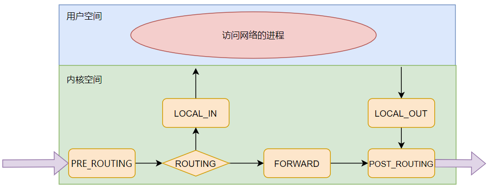

## iptables基本原理
&emsp;&emsp;`netfilter`是`Linux`内核的网络包过滤框架，而`iptables`则属于一个客户端代理，利用它将各种安全设定执行到对应的安全框架中，使得`netfilter`起到防火墙的作用。
&emsp;&emsp;网络包在进入主机时并不是直接进入对应的用户区软件程序中，而是先会经过内核区中几个'钩子'，如图1所示，，这几个'钩子'分别为：
1. `NF_IP_PRE_ROUTING`:刚刚通过数据链路层解包进入网络层的数据包通过此钩子
2. `NF_IP_LOCAL_IN`:经过路由查找后，送往本机（目的地址在本地）的包会通过此钩子
3. `NF_IP_FORWARD`:不是本地产生的并且目的地不是本地的包（即转发的包）会通过此钩子
4. `NF_IP_POST_ROUTING`:在包就要离开本机之前会通过该钩子
5. `NF_IP_LOCAL_OUT`:所有本地生成的发往其他机器的包会通过该钩子

每个钩子上会存放若干规则，规则串起来像条链子一样，故这五个钩子又被称为'五链'。并不是任意的规则可以放在任意的钩子中，也不是任意的钩子都可以设定任意的规则，所以其会将钩子与对应的规则按照功能分类到五个表中，分别为：
1. `raw`:用于决定数据包是否被状态跟踪机制处理，内建`PREROUTING`和`OUTPUT`两个链
2. `filter`:用于过滤，内建`INPUT`（目的地是本地的包）、`FORWARD`（不是本地产生的并且目的地不是本地）和`OUTPUT`（本地生成的包）等三个链
3. `nat`:用于网络地址转换，内建`PREROUTING`（在包刚刚到达防火墙时改变它的目的地址）、`INPUT`、`OUTPUT`和`POSTROUTING`（要离开防火墙之前改变其源地址）等链
4. `mangle`:用于对报文进行修改，内建`PREROUTING`、`INPUT`、`FORWARD`、`OUTPUT`和`POSTROUTING`等链
5. `security`:用于根据安全策略处理数据包，内建`INPUT`、`FORWARD`和`OUTPUT`链

同一条链中出现多个表中规则时，其优先级从高到低为： raw -> mangle -> nat -> filter -> security
&emsp;&emsp;最后了解下规则的基本形式，其由匹配条件和动作组成，比如我们可以在filter表中的某条链中配值源ip为`192.168.1.2`的数据包被`reject`此时源`ip`就是匹配条件，`reject`就是动作。
## iptables规则的增删改查
iptables查询规则的命令参数主要有如下：
`-t` : 指定要查询的表
`-L` : 不加参数，列出表中所有规则,也可指定链，列出链中规则
`-v` : 使信息更加详细
`-n` : 不对IP地址进行名称反解，直接显示IP地址
`-x` : 显示精确的匹配到包的总大小数值
`--line-number` : 指定显示的行号

